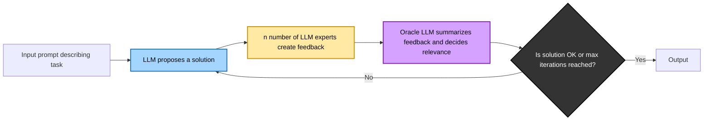

# 🧠 LLM Feedback Loop Executor

This is a Go-based application that enables structured, iterative task execution using large language models (LLMs) in a feedback-driven architecture. Configured using YAML, lets you define tasks, assign LLM workers and reviewers (experts), and orchestrate improvement cycles with an oracle model.

## 📌 Key Features

- Modular, block-based task configuration via YAML
- Iterative improvement using multiple LLMs (worker → expert review → oracle feedback)
- Support for multi-role LLM usage (e.g. developer, reviewer, writer)
- Output includes summaries and generated files
- Currently supports **OpenAI endpoints** (more providers planned)

---

## 📈 How It Works

The application implements the following loop for each defined block:



This feedback-refinement loop enables autonomous quality control and improvement using only LLMs.

## 🧾 Example Configuration

A typical YAML configuration defines blocks with LLM roles:

```yaml
blocks:
  - name: documentation
    iterations: 2
    filesOutput: true
    worker:
      name: technical-writer
      system: >
        You are a technical writer who understands Python. Generate README from JSON-formatted code.
      prompt: >
        You will receive a JSON file with filenames and content. Write an exhaustive README.

    experts:
      - name: docs-reviewer
        system: >
          You are an expert in technical writing. Provide constructive feedback.

    oracle:
      name: Documentation Oracle
      system: ""
```

See `example-configuration.yaml` for a complete reference.

## 🚀 How to Run

The easiest way to run the app is using the Makefile.

First, put OPEN AI API key in `.env` file and configure output directory:
```bash
OPENAI_API_KEY = <YOUR_KEY>
OUTPUT_DIRECTORY = <DIR_NAME>
```

then

```bash
make run
```

This runs:

```bash
go run . -config ./example-configuration.yaml
```

Prerequisites
* Go 1.24+
* Access to OpenAI API with credentials available via environment

## 🛠 Developer Tools
```bash
make test      # Run unit tests
make lint      # Lint the code using golangci-lint
make format    # Format code using gofmt
```

## 📂 Output

Each task block can produce:
* Directory with files containing the conversation and decisions
* Generated files (if filesOutput: true), e.g., source code, documentation

## 📚 Use Cases
* Code development with auto-improvement
* Iterative technical documentation generation
* Self-refining content generation
* Structured multi-agent prompting

## 🧭 Roadmap
* ✅ OpenAI endpoint support
* ✅ Feedback loop implementation
* ✅ YAML support
* ✅ Saving assistants conversations
* ✅ Suport structured output and save result files
* ⏳ Refactor code and configure linters
* ⏳ Move all prompts from code to YAML
* ⏳ Support for additional LLM providers (e.g., local models, Anthropic, Mistral)
* ⏳ Plugin architecture for custom workflows
* ⏳ Incorporate Browser Use for generated frontend verification
* ⏳ Web UI or CLI prompt editor

## 🪪 License
* MIT License